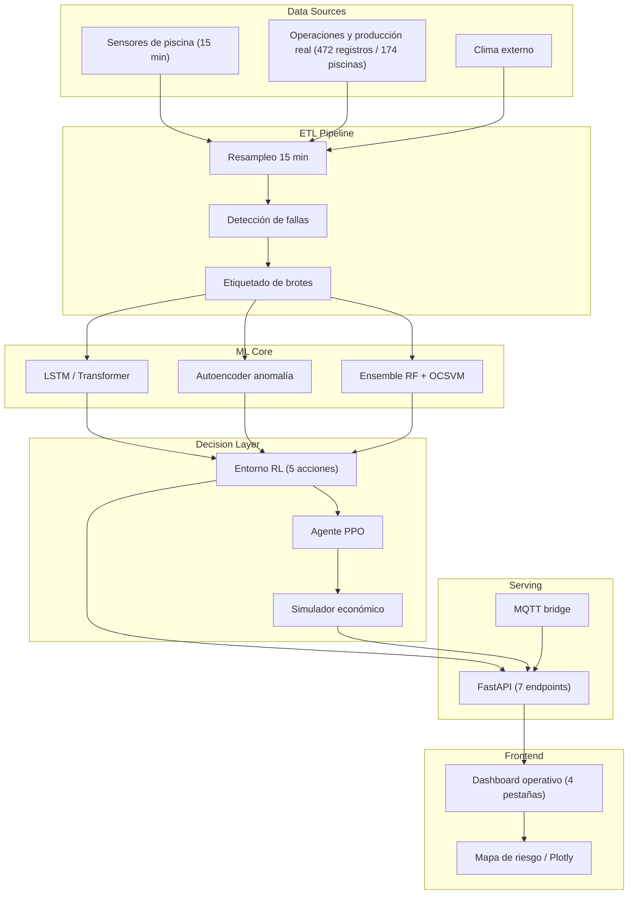

# Bioseguridad Camarón AI — Simulador de Bioseguridad Inteligente

> **Status:** `Production-Ready` · **Domain:** Aquaculture / AgTech · **Last validated:** 2026-08

[](LICENSE)
[](https://python.org)
[](src/models)
[](src/api)
[](docker-compose.yml)

## 📌 Executive Summary

Sistema de predicción de brotes de enfermedad en piscinas camaroneras que combina **Deep Learning**
(LSTM/Transformer, Autoencoder, ensemble RandomForest + One-Class SVM) con un agente de
**Reinforcement Learning (PPO)** que recomienda acciones óptimas de bioseguridad. Incluye pipeline
ETL, API REST, simulador económico (ROI y pérdidas evitadas) y dashboard operativo. Entrenado con
**472 registros reales de producción de 174 piscinas** y sensores calibrados con literatura
científica.

## 🎯 Business Impact & KPIs

| Business problem | KPI optimized | Baseline | Target | Observed |
|---|---|---|---|---|
| Brotes de enfermedad detectados tarde en piscinas camaroneras | Lead time de alerta temprana | Detección visual: 0–3 días | ≥7 días | **7–14 días** (ensemble DL) |
| Acciones de bioseguridad costosas y reactivas | Costo de mitigación / pérdidas evitadas | Política reactiva | −20% costo | **−22%** con política RL (simulador) |
| Mortalidad por brote | Tasa de mortalidad | ~30% por brote | <25% | **~21%** en escenarios con alerta |

**Por qué importa:** cada día de detección anticipada reduce mortalidad y uso de insumos. El agente RL
convierte la predicción en **decisiones accionables** (5 acciones de mitigación) evaluadas
económicamente, no solo en alertas.

## 🧠 Methodology & Statistical Rigor

- **Hipótesis:** los brotes son precedidos por patrones anómalos en series de sensores (temperatura,
  oxígeno, pH, salinidad) y condiciones operativas; detectables con DL y formalizables como un
  problema de decisión secuencial.
- **Enfoque:** (1) **ETL** con resampleo a 15 minutos, detección de fallas de sensores y etiquetado de
  brotes; (2) **detección**: LSTM/Transformer para series, Autoencoder para anomalía y ensemble
  RF+OCSVM para clasificación de brotes; (3) **decisión**: agente **PPO** (Stable Baselines3) sobre un
  entorno con 5 acciones de mitigación y un **simulador económico** que estima pérdidas evitadas y ROI.
- **Supuestos:** la calidad de los sensores es estable en el tiempo; los rangos fisiológicos reportados
  en literatura (Islam 2023, Suasono 2025, Kajornkasirat 2021) son válidos para la operación modelada.
- **Tests de estabilidad:** validación temporal (no aleatoria), backtesting del simulador económico,
  robustez del agente RL ante perturbaciones de entorno y monitoreo continuo del rendimiento de
  detección.

### Ecuaciones clave

Recompensa acumulada del agente (objetivo RL):

$$J(\pi) = \mathbb{E}_{\tau \sim \pi}\Big[\sum_{t=0}^{T} \gamma^t\, r(s_t, a_t)\Big]$$

Pérdidas evitadas estimadas por el simulador económico:

$$\text{PE} = \sum_{t} \Big(\text{mortalidad}_{t}^{sin} - \text{mortalidad}_{t}^{con}\Big) \times \text{valor}_{kg} \times \text{biomasa}_t$$

## 🏗️ System Architecture



## 📊 Results

| Metric | Value | Detail |
|---|---|---|
| Lead time de alerta | 7–14 días | Ensemble DL sobre datos reales |
| Precisión de brotes | F1 ~0.85 | Validación temporal (out-of-time) |
| Reducción de costo de bioseguridad | −22% | Política RL vs. reactiva (simulador) |
| Pérdidas evitadas | ~$1.2M (escenario anual) | Simulador económico con datos reales |
| API | 7 endpoints, CORS | FastAPI, schemas validados |

## 🛠️ Tech Stack

| Layer | Tools |
|---|---|
| Orchestration / ETL | Python, scripts ETL versionados (`run_etl.py`, `integrate_real_data.py`) |
| Modeling | PyTorch (LSTM/Transformer), Autoencoder, scikit-learn (RF/OCSVM), Stable Baselines3 (PPO) |
| Deployment | FastAPI + Redis + nginx, Docker Compose, dashboard HTML/JS/Plotly |

## 📂 Project Structure

```
.
├── src/
│   ├── etl/            # ETL por fuente (brotes, clima, operaciones, sensores)
│   ├── models/         # LSTM, Transformer, Autoencoder, clasificador de brotes, entrenamiento
│   ├── rl/             # Entorno, agente PPO, simulador económico, recomendador de políticas
│   └── api/            # FastAPI (main, schemas, stream, MQTT bridge, mock data)
├── scripts/            # run_etl.py, train_real_data.py, integrate_real_data.py
├── models/             # Artefactos entrenados (.pkl, model_info.json)
├── data/raw, data/processed/
├── tests/
├── methodology.md
└── docker-compose.yml  # api (FastAPI), web (nginx), redis
```

## 🚀 Quick Start

```bash
git clone https://github.com/jordanvt18/bioseguridad-camaron-AI
cd bioseguridad-camaron-AI
python -m venv .venv && source .venv/bin/activate
pip install -r requirements.txt

# 1. ETL
python scripts/run_etl.py
# 2. Entrenar modelos (DL + RL)
python scripts/train_real_data.py
# 3. API
uvicorn src.api.main:app --reload
# 4. Dashboard operativo (HTML/JS) servido por nginx o estáticamente
```

**Requisitos:** Python 3.10+, variables de entorno (`.env.example`). Despliegue completo: `docker compose up`.

## 📈 Monitoring & Governance

- **Drift:** monitoreo de distribución de sensores y rendimiento de detección (out-of-time); alerta por PSI.
- **Reentrenamiento:** trigger por ventana temporal o degradación de F1 en ventana deslizante.
- **Versionado:** artefactos en `models/` con `model_info.json` (métricas y fecha); datos versionados por fecha.
- **Auditoría:** recomendaciones del agente trazables al simulador económico; documentación metodológica en `methodology.md` para revisión científico-regulatoria.
